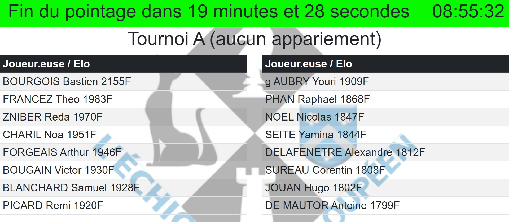

**[Retour au sommaire de la documentation](../README.md)**

# Papi-web - Utilisation d'un chronomètre

L'article 4.4 des règles générales pour les compétitions Fide mentionne à l'article 4.4 concernant la préparation de la salle de jeu :

> _Pour les événements FIDE de type L1 avec 30 joueurs ou plus, pour toute la compétition, un grand chronomètre numérique ou une horloge doit être installé dans l'aire de jeu. Pour les événements FIDE inférieurs à 30 joueurs, une annonce en bonne et due forme doit être faite 5 minutes avant le début des parties puis une autre 1 minute avant le début des parties._ 

Cet affichage est parfaitement pris en charge par Papi-web grâce à son chronomètre.

## Fonctionnement du chronomètre

Plusieurs horaires sont définis dans la configuration d'un évènement pour permettre d'afficher aux joueur·euses le déroulé de la compétition, en particulier le démarrage des rondes.

Papi-web affiche en permanence le temps restant avant l'horaire suivant, sous la forme d'un bandeau :



Au fur et à mesure du temps, le bandeau change de couleur pour indiquer aux joueur·euses que les échéances se rapprochent :


Le synopsis de l'affichage du bandeau est le suivant :


## Configuration des horaires

Les horaires sont définis dans la configuration avec pour chacun une rubrique `[timer.hour.<event_id>]`, où `<event_id>` est l'identifiant de l'horaire :

```
[timer.hour.pointage]
date = 2023-08-28 09:15
text_before = Fin du pointage dans %s
text_after = Pointage terminé depuis %s
```

Le jour du premier horaire est obligatoirement précisé, pour les horaires suivants la simple indication de l'heure est suffisante.

```
[timer.hour.1]
date = 09:30
[timer.hour.2]
date = 13:15
[timer.hour.3]
date = 16:30
[timer.hour.4]
date = 2023-07-09 09:30
[timer.hour.5]
date = 13:30
```

Les horaires dont les identifiants sont des numéros correspondent aux horaires de début des rondes. Pour ces horaires particuliers, les textes affichés sur le bandeau du chronomètre sont par défaut `text_before = Début de la ronde <round_id> dans %s` et `text_after = Ronde <round_id>> commencée depuis %s`.

```
[timer.hour.remise-des-prix]
date = 16:30
text_before = Remise des prix dans %s
text_after = Remise des prix commencée depuis %s
```

## Personnalisation des couleurs et des délais du chronomètre

Les couleurs et les délais par défaut peuvent être personnalisées aux formats `#RRGGBB`, `#RGB` ou `rgb(RRR, GGG, BBB)`, les valeurs par défaut sont indiquées ci-dessous.


```
[timer.colors]
1 = #00ff00
2 = #ffa700
3 = #ff0000
```

Les délais de fonctionnement du chronomètre sont exprimés en minutes :

```
[timer.delays]
1 = 15
2 = 5
3 = 10
```

